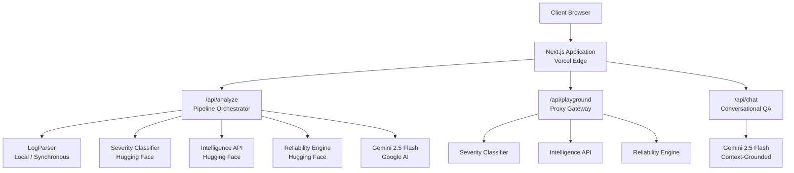
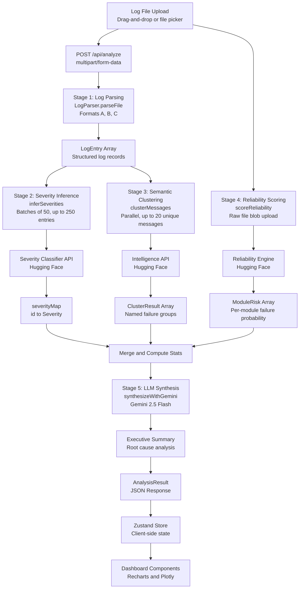

# AI Powered RTL Debug Prioritization Platform

An AI driven system that analyzes RTL verification logs, identifies failure patterns, and prioritizes critical debugging targets using machine learning inference and large language model synthesis.

---

## Product Overview

Register-Transfer Level simulation generates tens of thousands of log lines per run. At modern design complexity, a single block-level simulation can produce hundreds of thousands of entries spanning timing violations, protocol mismatches, memory interface errors, and power domain faults. Manually triaging this output is not scalable. Critical failures are buried under informational telemetry, and engineering hours are consumed by log parsing rather than root-cause investigation.

This platform resolves that bottleneck. Log files are ingested, parsed, and processed through a multi-stage ML pipeline that classifies each entry by severity, clusters semantically related failures, scores per-module reliability risk, and synthesizes an LLM-generated executive summary with actionable root cause hypotheses. The result is a structured, prioritized view of verification failures ready for immediate engineering action.

---

## Key Capabilities

**Automated Log Parsing**
A multi-format parser normalizes heterogeneous RTL simulation output. Three recognized formats are supported natively: timestamp-module-message (Format A), bracketed timestamp-module-message (Format B), and timestamp-severity-module-message (Format C). The parser extracts structured fields from each line and flags malformed entries without halting ingestion.

**Severity Classification**
Log entries without explicit severity tags are submitted in batches to a remote severity classifier hosted on Hugging Face Spaces. The model predicts one of four tiers: INFO, WARNING, ERROR, or CRITICAL. Batch processing caps at 250 entries across five concurrent batches with a 10-second per-request timeout to maintain pipeline throughput.

**Semantic Failure Clustering**
Up to 20 unique message strings from the parsed log set are submitted in parallel to the Intelligence API. The service maps each message to a named failure cluster using embedding similarity, returning a cluster ID, cluster name, subsystem label, anomaly flag, and similarity confidence score. Results are propagated back to all log entries sharing the same message string.

**Module Reliability Scoring**
The raw log file is submitted to a dedicated Reliability Engine that computes per-module failure probability. Output includes failure probability (0.0 to 1.0), risk tier classification (low, medium, high), and error count per module. The platform normalizes both array and object response schemas from the upstream service for compatibility.

**LLM Root Cause Synthesis**
Gemini 2.5 Flash is invoked with a structured prompt containing severity statistics, high-risk module data, top cluster annotations, and critical log samples. The model returns a five-section analysis: executive summary, root cause hypotheses, affected module identification, recommended debugging actions, and overall risk assessment.

**Interactive Debugging Dashboard**
A real-time web dashboard presents severity distributions, error timelines, module risk heatmaps, cluster distributions, and a full log viewer with inline AI insight annotations. An integrated chat interface allows engineers to query the analysis context using natural language.

**Technical Playground**
An IDE-style interface for direct invocation of individual inference endpoints. Engineers can submit custom payloads to the Severity Classifier, Intelligence API, and Reliability Engine independently and inspect raw request and response objects with timing metrics.

---

## System Architecture

The platform follows a layered architecture with a Next.js frontend serving as both the user interface host and the API gateway. All ML inference is delegated to external microservices hosted on Hugging Face Spaces. The Gemini API handles LLM synthesis server-side.



**Frontend State**
Zustand manages global application state including file metadata, pipeline step and progress, full analysis results, active filters, and chat history. State persists across route transitions within the session.

**Pipeline Resilience**
Each pipeline stage is wrapped in an independent try-catch block. Failure of any individual upstream service does not abort the pipeline. Partial results are returned with availability flags indicating which services responded successfully.

---

## Machine Learning Pipeline

### Stage 1: Log Parsing (Local)

The `LogParser` class applies three regular expressions in priority order. Format C is tested first as it is the most specific, containing an explicit severity tag. Formats A and B are attempted sequentially for untagged entries. Malformed lines are tracked in a skip list but do not interrupt parsing.

Extracted fields per entry:

| Field | Type | Description |
|---|---|---|
| id | string | Unique entry identifier (line number + timestamp) |
| line | number | Source line number |
| time | string | Simulation timestamp in nanoseconds |
| module | string | RTL module name |
| message | string | Log message body |
| severity | Severity or null | Explicit tag if present, null if untagged |
| format | A, B, C, unknown | Detected log format |

### Stage 2: Severity Inference

Entries where `severity` is null are batched in groups of 50 and submitted to the Severity Classifier API. The request schema is:

```json
{
  "logs": [
    { "module": "ClkGen", "message": "Clock edge detected" }
  ]
}
```

The service returns a `results` array of `SeverityPrediction` objects. Predicted severities are merged into the entry set. Entries for which the classifier fails default to INFO.

### Stage 3: Semantic Clustering

Unique message strings (capped at 20) are submitted in parallel to the Intelligence API. Each request carries a single `log_text` string. The service returns cluster metadata including a named failure category, subsystem attribution, anomaly detection flag, and cosine similarity score. Results are deduplicated and mapped back to all entries sharing each message string.

```json
{
  "log_text": "Memory interface timeout after 32 wait states"
}
```

Response schema:

```json
{
  "input_log": "...",
  "analysis": {
    "cluster_id": 7,
    "cluster_name": "Memory Interface Fault",
    "subsystem": "MEM_CTRL",
    "description": "Timeout pattern consistent with clock domain crossing violation",
    "similarity_score": 0.91,
    "anomaly": true
  }
}
```

### Stage 4: Reliability Scoring

The raw log file is submitted as multipart form data to the Reliability Engine. The engine performs frequency-weighted error analysis per RTL module and returns a scored risk profile.

Response schema:

```json
{
  "module_risk": [
    {
      "module": "DRAM_CTRL",
      "failure_probability": 0.83,
      "risk": "high",
      "error_count": 147
    }
  ]
}
```

Risk tier thresholds:

| Probability | Tier |
|---|---|
| >= 0.70 | high |
| >= 0.40 | medium |
| < 0.40 | low |

### Stage 5: LLM Synthesis

A structured prompt is constructed from pipeline outputs and submitted to Gemini 2.5 Flash. The model is instructed to return five sections: executive summary, root causes, affected modules, recommended actions, and risk assessment. Safety filters are set to BLOCK_NONE to prevent false positives from technical RTL terminology.

---

## Data Flow



Client-side state updates are reactive. Once the `AnalysisResult` is stored, all dashboard components re-render synchronously. Filters (severity, cluster, search query) operate on the cached result without re-fetching.

---

## Repository Structure

```
src/
  app/
    api/
      analyze/route.ts      Pipeline orchestration endpoint
      chat/route.ts         Conversational QA endpoint
      playground/route.ts   Inference proxy gateway
    dashboard/page.tsx      Analysis dashboard route
    log-explorer/page.tsx   Full log viewer route
    playground/page.tsx     Technical playground route
    page.tsx                Log upload and pipeline trigger
    layout.tsx              Root layout with sidebar and header
    globals.css             Design system tokens and animations

  components/
    dashboard/
      AIInsightsPanel.tsx         LLM summary and root cause display
      BugTable.tsx                Filterable log table with cluster annotations
      ClusterDistribution.tsx     Cluster frequency chart
      ErrorTimelineChart.tsx      Error count over simulation time
      ModuleRiskHeatmap.tsx       Per-module failure probability heatmap
      ModuleSeverityHeatmap.tsx   Severity distribution by module
      SeverityBreakdownChart.tsx  Severity tier pie chart
      SummaryCards.tsx            Key metric summary tiles
    layout/
      Header.tsx                  Pipeline status bar
      Sidebar.tsx                 Collapsible navigation panel
    log-explorer/
      LogViewer.tsx               Virtual log table with inline AI panel
    playground/
      ModelPlayground.tsx         Endpoint testing IDE
    upload/
      FileDropzone.tsx            Drag-and-drop log ingestion

  lib/
    analysisOrchestrator.ts       Pipeline stage execution and coordination
    geminiClient.ts               Gemini 2.5 Flash prompt construction and invocation
    logParser.ts                  Multi-format RTL log normalization

  store/
    analysisStore.ts              Zustand global state with pipeline and result management

  types/
    index.ts                      Shared TypeScript interfaces for all data structures
```

---

## API Reference

### POST /api/analyze

Executes the full five-stage analysis pipeline on an uploaded RTL log file.

**Request**

Content-Type: `multipart/form-data`

| Field | Type | Description |
|---|---|---|
| file | File | RTL simulation log (.log, .txt, .sim, .out) |

**Response**

```json
{
  "logs": [ { "id": "...", "line": 1, "time": "100", "module": "ClkGen", "message": "...", "severity": "ERROR", "format": "A" } ],
  "clusters": [ { "logId": "...", "cluster_id": 3, "cluster_name": "Clock Domain Fault", "confidence": 0.88, "anomaly": true } ],
  "moduleRisks": [ { "module": "DRAM_CTRL", "failure_probability": 0.83, "risk_level": "high", "error_count": 147 } ],
  "summary": "Executive analysis generated by Gemini 2.5 Flash...",
  "reliabilityUnavailable": false,
  "stats": {
    "total": 1842,
    "errorDensity": 12.4,
    "criticalCount": 23,
    "highRiskModules": 4,
    "formatBreakdown": { "A": 900, "B": 600, "C": 300, "unknown": 42 },
    "severityBreakdown": { "INFO": 1200, "WARNING": 400, "ERROR": 200, "CRITICAL": 42 }
  }
}
```

**Error Codes**

| Code | Cause |
|---|---|
| 400 | No file in request body |
| 422 | File parsed but no valid log entries found |
| 500 | Unhandled parsing error |

---

### POST /api/playground?endpoint={key}

Proxy gateway for direct invocation of individual inference endpoints.

**Parameters**

| Key | Upstream Service | Payload Type |
|---|---|---|
| severity | RTL Log Severity Classifier | JSON |
| intelligence | RTL Log Intelligence API | JSON |
| reliability | RTL Reliability Engine | multipart/form-data |

**Severity Request**

```json
{
  "logs": [
    { "module": "ArbiterFSM", "message": "Arbitration timeout at cycle 4200" }
  ]
}
```

**Intelligence Request**

```json
{
  "log_text": "PHY transceiver lock lost after power cycle"
}
```

**Reliability Request**

Content-Type: `multipart/form-data` with field `file` containing the raw log file.

---

### POST /api/chat

Context-grounded question answering over a cached analysis result.

**Request**

```json
{
  "question": "Which module has the highest failure probability?",
  "analysis": { "stats": {}, "moduleRisks": [], "clusters": [], "logs": [], "summary": "" }
}
```

**Response**

```json
{
  "answer": "DRAM_CTRL at 83.0% failure probability with 147 error events."
}
```

---

## Dashboard

**Summary Cards**
Four metric tiles display total log entries, error density percentage, critical failure count, and high-risk module count. Values update immediately on result load.

**Severity Breakdown Chart**
A pie chart built with Recharts visualizes the proportion of INFO, WARNING, ERROR, and CRITICAL entries. Interactive legend filtering is supported.

**Error Timeline Chart**
A line chart plots cumulative error and critical event counts over simulation time, surfacing burst patterns and failure accumulation zones.

**Module Risk Heatmap**
A ranked bar or heatmap visualization of per-module failure probability with color-coded risk tier indicators. Enables immediate identification of highest-priority investigation targets.

**Module Severity Heatmap**
Cross-tabulation of severity tier distribution per module, exposing which modules generate the most WARNING or ERROR volume relative to their total output.

**Cluster Distribution**
A frequency chart of named failure clusters identified by the Intelligence API, ranked by occurrence count.

**AI Insights Panel**
Renders the Gemini-generated executive summary in structured markdown. Displays root cause hypotheses, affected module list, recommended debugging steps, and risk assessment.

**Bug Table**
A full searchable, filterable log viewer with columns for line number, simulation time, module, message, severity tier, and cluster assignment. Severity and cluster filters operate on cached data without re-fetching. An inline floating panel provides per-entry AI annotation on demand.

**Log Viewer**
A dedicated route presenting the complete parsed log set with virtual rendering for performance on large files. Supports full-text search and severity filtering with real-time highlighting.

---

## Deployment

### Prerequisites

Node.js 18 or later is required. A Google AI API key with access to Gemini 2.5 Flash is required for LLM synthesis and chat. External Hugging Face Spaces endpoints must be accessible from the deployment environment.

### Environment Configuration

Create `.env.local` at the project root:

```
GOOGLE_API_KEY=your_google_ai_api_key
```

### Installation

```bash
npm install
```

### Development

```bash
npm run dev
```

The application starts on `http://localhost:3000`.

### Production Build

```bash
npm run build
npm start
```

### Vercel Deployment

The repository includes a `vercel.json` configuration. Deploy directly from the repository root using the Vercel CLI or GitHub integration. Ensure environment variables are configured in the Vercel project settings before deploying.

---

## Inference Services

Three microservices handle ML inference. All are hosted on Hugging Face Spaces and expose REST APIs.

| Service | Endpoint Path | Framework |
|---|---|---|
| Severity Classifier | `/predict_batch` | FastAPI |
| Intelligence API | `/analyze_log` | FastAPI |
| Reliability Engine | `/predict_file` | FastAPI |

Each service is invoked with a 10-second timeout per request. The orchestrator processes batches of severity predictions sequentially and clustering requests in parallel. Service failures are caught individually and do not propagate to adjacent pipeline stages.

---

## Example Workflow

An engineer uploads a simulation log from a block-level regression run via the drag-and-drop interface or by clicking the upload zone.

The `/api/analyze` endpoint receives the file as multipart form data. The `LogParser` normalizes the content to a structured entry array. Entries without explicit severity tags are batched and submitted to the Severity Classifier. The severity map is applied to all entries before proceeding.

Unique message strings are submitted in parallel to the Intelligence API. Each message is mapped to a named failure cluster with a subsystem label and anomaly score. The raw file is uploaded to the Reliability Engine which returns per-module failure probabilities.

Statistics are computed across the enriched entry set. The full result object is passed to Gemini 2.5 Flash which generates a structured root cause analysis. The complete `AnalysisResult` is returned from the API and stored in the Zustand store.

The dashboard renders automatically. The engineer reviews the Module Risk Heatmap to identify the three highest-probability failure modules, reads the AI Insights Panel for root cause hypotheses, and queries the chat interface to ask targeted questions about specific clusters. The Bug Table is filtered to CRITICAL entries for detailed trace inspection.

---

## Performance Considerations

**Log Volume**
The parser processes files of arbitrary size in a single pass with O(n) complexity. There is no server-side file size limit beyond the Vercel request body limit of approximately 4.5 MB for edge functions.

**Clustering Throughput**
Clustering is capped at 20 unique messages and 100 total entries to prevent upstream API saturation. This covers the statistically dominant failure patterns in most simulation runs while keeping pipeline latency under 15 seconds for typical inputs.

**Client Rendering**
The Log Viewer uses virtual rendering for tables exceeding standard viewport capacity. Filters apply on in-memory data to eliminate network round-trips during interactive exploration.

**Timeout Management**
All upstream service calls use an AbortController-based timeout of 10 seconds. This prevents stalled connections from blocking the pipeline indefinitely under degraded network conditions.

---

## Extension Points

**Verification Framework Integration**
The log parser can be extended with additional format patterns to support output from industry-standard simulators including Synopsys VCS, Cadence Xcelium, and Mentor Questa without changes to the downstream pipeline.

**Historical Bug Database Training**
The severity and intelligence models can be retrained on historical simulation databases to improve accuracy for organization-specific RTL design patterns and naming conventions.

**Real-Time Simulation Monitoring**
The pipeline can be adapted to accept streaming log input via WebSocket, enabling live analysis during simulation runs rather than post-hoc batch processing.

**Automated Report Generation**
The `AnalysisResult` schema is fully structured and can be consumed by a reporting layer to generate PDF or HTML bug reports with cluster summaries and module risk tables formatted for design review meetings.

**Regression Trend Analysis**
By persisting `AnalysisResult` objects across simulation runs, the platform can be extended to surface regression trends: tracking which modules accumulate error density over successive iterations of RTL development.

---

## Development Team

VIT Bhopal University

| Engineer | Area |
|---|---|
| Abhinav Kumar | AI and Backend Engineering |
| Nishant Aryan | Frontend Development |
| Harsh Kumar Mishra | Systems Architecture |
| Ayush Gupta | Data Pipeline Design |
| Aditya Verma | Verification Strategy |
